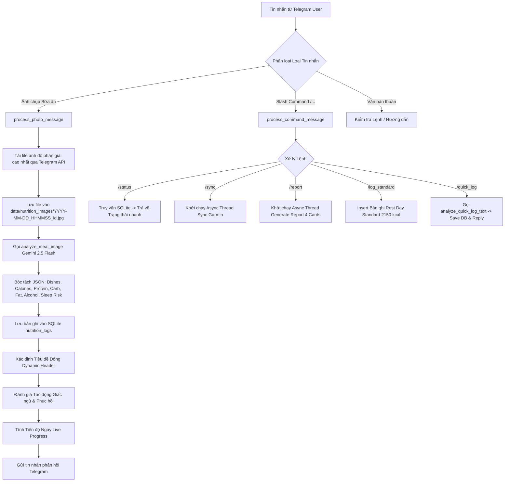
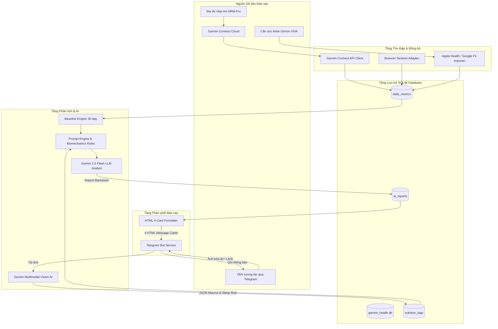
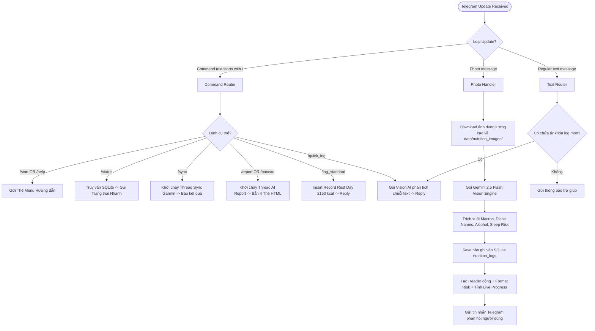
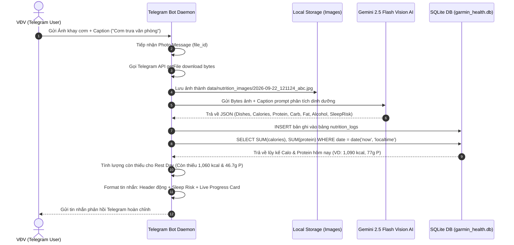

# 🏗️ ARCHITECTURE & TECHNICAL SPECIFICATION
## GARMIN HEALTH AI PIPELINE & TELEGRAM NUTRITION BOT

> **Dự án:** Garmin Health AI Pipeline & Precision Nutrition Bot  
> **Tác giả / VĐV:** VĐV Đa môn (Multi-Sport Athlete & Full Marathon Runner)  
> **Mục tiêu hệ thống:** Tự động hóa đồng bộ dữ liệu sinh lý học Garmin/Omron, bóc tách động học bước chạy HRM-Pro, phân tích dinh dưỡng đa phương thức (Gemini Vision AI) và kê đơn phục hồi y học thể thao chuẩn xác trong giai đoạn **Tapering 12 ngày trước giải Hanoi Full Marathon (04/10/2026)**.

---

## 1. 📲 TỔNG HỢP TOÀN BỘ TELEGRAM COMMANDS & TƯƠNG TÁC BOT (TELEGRAM INTERFACE)

Hệ thống giao tiếp Telegram (`src/delivery/telegram_bot.py`) hoạt động dựa trên cơ chế **Long-Polling (`getUpdates`)**, tiếp nhận hai luồng tương tác chính: Lệnh điều khiển dạng Slash Commands và Tin nhắn đa phương tiện (Ảnh chụp bữa ăn / Văn bản / Quick Log).

### 1.1. Bảng danh mục lệnh Telegram Commands (Command Reference)

| Lệnh (Slash Command) | Cú pháp (Syntax) | Tham số (Parameters) | Mô tả Chức năng & Luồng Xử Lý Backend |
| :--- | :--- | :--- | :--- |
| `/start` \| `/help` | `/start`<br>`/help` | Không có | Hiển thị Thẻ Menu hướng dẫn chi tiết các chức năng của Bot, danh mục lệnh điều khiển và cách chụp ảnh bữa ăn. |
| `/status` | `/status` | Không có | **Báo cáo Trạng thái Nhanh**: Truy vấn trực tiếp từ SQLite `daily_metrics` & `nutrition_logs` cho ngày hôm nay (múi giờ GMT+7). Trả về các chỉ số: Sleep Score, Deep Sleep, HRV Overnight, RHR, Cân nặng Omron, Bước chân và Tổng lũy kế Calo/Macros đã nạp. |
| `/sync` | `/sync` | Không có | **Đồng bộ Dữ liệu Nền**: Kích hoạt `_run_sync_async` trong Thread riêng để kéo dữ liệu mới nhất từ Garmin Connect API & Omron VIVA về SQLite mà không tốn Token gọi AI Report. |
| `/report` \| `/baocao` | `/report`<br>`/baocao` | Không có | **Sinh Báo cáo Y học Thể thao 4 Thẻ**: Kích hoạt `_run_report_async` trong Thread riêng. Tiến trình bao gồm: Sync dữ liệu -> Tính toán Baseline toàn lịch sử -> Gọi Gemini LLM phân tích sinh lý học -> Ghi DB `ai_reports` -> Chia nhỏ & bắn 4 Message Cards HTML về Telegram. |
| `/log_standard` \| `/logstandard` | `/log_standard` | Không có | **Nạp Ước Lượng Chuẩn Rest Day**: Tự động ghi vào `nutrition_logs` 1 bản ghi tiêu chuẩn ngày nghỉ phục hồi (2,150 kcal, 122g Protein, 260g Carbs, 60g Fat, 0 cồn, `meal_type='daily_estimate'`) và tính toán lại tiến độ dinh dưỡng. |
| `/quick_log` \| `/quicklog` \| `/log` | `/quick_log [mô tả]` | `[mô tả văn bản]` *(Ví dụ: `/quick_log 1 phở bò bắp bữa sáng và 1 cơm tấm bữa trưa`)* | **Ghi Nhanh Bữa Ăn Qua Văn Bản**: Chuyển chuỗi văn bản sang `analyze_quick_log_text()` (gọi Gemini Vision AI), trích xuất danh sách món, ước tính Calo/Macros, lưu vào SQLite và trả về phản hồi kèm tiến độ ngày. *Nếu không truyền mô tả, bot sẽ hiển thị hướng dẫn sử dụng.* |

---

### 1.2. Cơ chế Xử lý Tin nhắn Đa phương tiện (Media & Text Handling Workflow)



#### 💡 Quy tắc Động hóa Tiêu đề Phản hồi (Dynamic Header Rules)
Bot phân tích thành phần món ăn, lượng cồn và calo để tự động gán nhãn tiêu đề phù hợp:
1. **Có cồn (`alcohol_units > 0` hoặc từ khóa bia/rượu/cocktail):**  
   👉 `🍻 BÁO CÁO ĐỒ NHẬU & NỒNG ĐỘ CỒN`
2. **Nước lọc / Nước suối ấm (`calories == 0` hoặc từ khóa nước lọc/khoáng):**  
   👉 `💧 NHẬT KÝ NƯỚC UỐNG & BÙ NƯỚC`
3. **Nước ép / Sinh tố / Cà phê / Trà / Kombucha:**  
   👉 `🥤 NHẬT KÝ THỨC UỐNG & VI CHẤT`
4. **Bữa phụ / Snack / Sữa chua Hy Lạp / Trái cây:**  
   👉 `🥗 NHẬT KÝ BỮA PHỤ PHỤC HỒI`
5. **Bữa chính (Sáng / Trưa / Tối):**  
   👉 `🍽️ NHẬT KÝ BỮA ĂN & MACRO`

---

### 1.3. Đánh giá Cơ chế Xử lý Tiến trình Bot (Process & Instance Audit)

> [!WARNING]
> **Kết quả Audit Tiến trình Bot (`TelegramMealBot`):**
> Hiện tại lớp `TelegramMealBot` chạy bằng vòng lặp Long-Polling (`getUpdates`). Nếu khởi chạy đồng thời 2 tiến trình (`python main.py bot`) trên cùng 1 Telegram Bot Token, Telegram API sẽ trả về lỗi **HTTP 409 Conflict** (*"terminated by other getUpdates request"*).
>
> **Giải pháp Kiến trúc Đã đề xuất (Roadmap):** Triển khai File Lock / PID Lock (`data/bot.pid`) sử dụng thư viện `fcntl` (Linux/macOS) hoặc `msvcrt` (Windows) để ngăn ngừa tuyệt đối việc khởi chạy trùng lặp bot background.

---

## 2. ⚙️ TỔNG QUAN HỆ THỐNG & CÁC CHỨC NĂNG BACKEND ĐÃ TRIỂN KHAI

### 2.1. Garmin API & Sync Pipeline (`src/ingestion/`)
- **Module chính:** [`garmin_client.py`](file:///c:/Users/linhn/.gemini/antigravity-ide/scratch/garmin-health-ai-pipeline/src/ingestion/garmin_client.py), [`collector.py`](file:///c:/Users/linhn/.gemini/antigravity-ide/scratch/garmin-health-ai-pipeline/src/ingestion/collector.py), [`browser_session_client.py`](file:///c:/Users/linhn/.gemini/antigravity-ide/scratch/garmin-health-ai-pipeline/src/ingestion/browser_session_client.py).
- **Chức năng:**
  - Đồng bộ tự động toàn bộ dữ liệu sinh lý học daily từ Garmin Connect API: Sleep score & Sleep stages (Deep, REM, Light, Awake), HRV Overnight & 7-day average, Resting Heart Rate (RHR), Stress level, Body Battery (Charged/Drained), Respiration (brpm), SpO2 (avg/min), Training Readiness, Training Load 7d, Training Status.
  - Kéo danh sách bài tập chi tiết (`get_activities_by_date`) để tính toán chính sở bước chạy vs bước đi bộ NEAT.
  - **Cơ chế Dự phòng (Browser Adapter):** Tích hợp `browser_session_client.py` cho phép nhập Cookie/cURL từ trình duyệt khi login di động bị nghẽn HTTP 429 Rate Limit.

### 2.2. Biomechanics Analyzer (HRM-Pro Running Dynamics)
- **Module chính:** [`prompt_engine.py`](file:///c:/Users/linhn/.gemini/antigravity-ide/scratch/garmin-health-ai-pipeline/src/analytics/prompt_engine.py), [`llm_analyst.py`](file:///c:/Users/linhn/.gemini/antigravity-ide/scratch/garmin-health-ai-pipeline/src/analytics/llm_analyst.py).
- **Chức năng:**
  - Bóc tách chỉ số động học từ đai tim Garmin HRM-Pro: Nhịp bước (Cadence), Độ dài sải chân (Stride Length), Độ nảy cơ thể (Vertical Oscillation) và đặc biệt là **Cân bằng thời gian tiếp đất GCT Balance (% L / % R)**.
  - Nhận diện sự bất cân đối sinh học (ví dụ: `51.7% Left / 48.3% Right` trong bài Long Run 21km), phát hiện nguy cơ lệch tải dồn xung lực va đập cơ học sang chân trái và tự động kê đơn bài tập phục hồi thụ động gân Achilles (*Eccentric Heel Drops*).

### 2.3. Vision Nutrition Analyzer (`src/analytics/vision_analyst.py`)
- **Module chính:** [`vision_analyst.py`](file:///c:/Users/linhn/.gemini/antigravity-ide/scratch/garmin-health-ai-pipeline/src/analytics/vision_analyst.py).
- **Chức năng:**
  - Sử dụng Gemini Multimodal Vision API (`gemini-2.5-flash`).
  - Phân tích ảnh khay cơm văn phòng, món ăn đường phố Việt Nam, nước uống, đồ nhậu.
  - Quy tắc phân tích đạm Việt Nam chuẩn xác: Phân biệt rõ thịt rim/xào vs đậu phụ, tính thêm Protein & Fat từ lạc rang (đậu phộng) đạt 45g - 50g Protein thực tế.
  - Đánh giá khoảng thời gian tiêu hóa tới mốc ngủ 21:30 để đưa ra cảnh báo rủi ro phục hồi.

### 2.4. Daily Progress Calculation (`src/db/nutrition_repository.py`)
- **Module chính:** [`nutrition_repository.py`](file:///c:/Users/linhn/.gemini/antigravity-ide/scratch/garmin-health-ai-pipeline/src/db/nutrition_repository.py).
- **Chức năng:**
  - Hàm `get_today_nutrition_summary()` thực thi SQL truy vấn chính xác theo múi giờ địa phương GMT+7:
    ```sql
    SELECT 
        COALESCE(SUM(total_calories), 0) as total_cal,
        COALESCE(SUM(protein_g), 0) as total_protein,
        COALESCE(SUM(carb_g), 0) as total_carbs,
        COALESCE(SUM(fat_g), 0) as total_fat
    FROM nutrition_logs
    WHERE date = date('now', 'localtime') OR date(timestamp) = date('now', 'localtime')
    ```
  - Tính toán chính xác Calo & Protein còn thiếu cho bữa tối so với mục tiêu Rest Day (**2,150 kcal & 123.7g Protein**).

### 2.5. Prompt Engine & Medical Analytics (`src/analytics/prompt_engine.py`)
- **Module chính:** [`prompt_engine.py`](file:///c:/Users/linhn/.gemini/antigravity-ide/scratch/garmin-health-ai-pipeline/src/analytics/prompt_engine.py), [`baseline.py`](file:///c:/Users/linhn/.gemini/antigravity-ide/scratch/garmin-health-ai-pipeline/src/analytics/baseline.py).
- **Chức năng:**
  - Tính toán Baseline 30 ngày tích lũy cho HRV, RHR, Deep Sleep.
  - Áp dụng nguyên tắc **TÁCH BIỆT DINH DƯỠNG**: Giấc ngủ đêm hôm trước CHỈ được đối chiếu với nhật ký ăn uống ngày hôm qua; Các bữa ăn ngày hôm nay CHỈ được xếp vào nhóm tiến độ nạp hôm nay để kê đơn bữa tối.
  - Định dạng đầu ra thành 4 thẻ thông điệp phân cách bằng `===SECTION_BREAK===`.

---

## 3. 🎯 GIÁ TRỊ VÀ LỢI ÍCH CỦA HỆ THỐNG (BENEFITS FOR MARATHON ATHLETE)

Dự án mang lại giá trị cốt lõi cho VĐV Đa môn trong giai đoạn **12 ngày Tapering trước giải Hanoi Full Marathon (04/10/2026)**:

1. **Giám sát Phục hồi Hệ Thần kinh Tự chủ (ANS Recovery Monitoring):**
   - Theo dõi sự tương quan giữa HRV Overnight và Nhịp tim nghỉ RHR so với Baseline toàn lịch sử. Đảm bảo hệ phó giao cảm (Parasympathetic Nervous System) chiếm ưu thế để cơ thể đi vào trạng thái siêu bù đắp (Supercompensation).

2. **Phòng ngừa Chấn thương Động học Cá nhân hóa (Injury Prevention):**
   - Giám sát độ lệch GCT Balance (ví dụ `51.7% Left`). Kịp thời phát hiện hiện tượng né lực mỏi chân phải dồn trọng lượng sang gân Achilles & dải chậu chày chân trái, kê đơn chườm lạnh & bài tập *Eccentric Heel Drops* trước khi xảy ra viêm gân cấp tính.

3. **Dinh dưỡng Chính xác & Bảo vệ Giấc ngủ Deep Sleep (Precision Nutrition):**
   - Tự động hóa tính toán Macros hàng ngày, kiểm soát cồn và thời gian ăn tối sát giờ ngủ (trước 21:30) để tránh tăng RHR đêm, bảo vệ giai đoạn ngủ sâu (Deep Sleep > 1 giờ) giải phóng HGH tái tạo mô cơ.

---

## 4. 📊 SƠ ĐỒ MERMAID HỆ THỐNG (MERMAID DIAGRAMS)

### Sơ đồ 1: Architecture Overview (Kiến trúc Tổng thể Pipeline)



---

### Sơ đồ 2: Telegram Bot Command & Event Router Flow



---

### Sơ đồ 3: Meal Vision & Nutrition Logging Sequence Diagram



---

## 5. 🗄️ CƠ SỞ DỮ LIỆU (DATABASE SCHEMA & DATA DICTIONARY)

Toàn bộ hệ thống lưu trữ dữ liệu tập trung trong cơ sở dữ liệu SQLite: `data/garmin_health.db`.

### 5.1. Danh mục các bảng trong SQLite Database

1. `daily_metrics`: Bảng lưu trữ chỉ số sinh lý học hàng ngày (Sleep, HRV, RHR, Body Battery, Steps, Weight, Muscle, Visceral Fat).
2. `nutrition_logs`: Bảng lưu trữ nhật ký bữa ăn, đồ uống, cồn và đánh giá tác động giấc ngủ.
3. `ai_reports`: Bảng lưu trữ báo cáo AI y học thể thao, prompt thô, số lượng token sử dụng và trạng thái phân phối.
4. `raw_garmin_data`: Bảng lưu trữ JSON thô từ Garmin API hỗ trợ truy vết lỗi.

---

### 5.2. Data Dictionary - Bảng `nutrition_logs`

| Tên cột (Column Name) | Kiểu dữ liệu | Ràng buộc (Constraints) | Mô tả chi tiết (Description) |
| :--- | :--- | :--- | :--- |
| `id` | `INTEGER` | `PRIMARY KEY AUTOINCREMENT` | Mã định danh duy nhất của bản ghi dinh dưỡng. |
| `date` | `TEXT` | `NOT NULL` | Ngày ghi nhận bữa ăn (Định dạng `YYYY-MM-DD`). |
| `timestamp` | `DATETIME` | `DEFAULT CURRENT_TIMESTAMP` | Nhãn thời gian chính xác của bữa ăn (`YYYY-MM-DD HH:MM:SS`). |
| `meal_type` | `TEXT` | Nullable | Phân loại bữa ăn: `Bữa sáng`, `Bữa trưa`, `Bữa tối`, `Thức uống`, `Bữa phụ`, `daily_estimate`. |
| `dishes` | `TEXT` | Nullable | Chuỗi JSON danh sách các món ăn bóc tách được (VD: `["Bánh mì phô mai", "1 ly cà phê"]`). |
| `total_calories` | `INTEGER` | Nullable | Tổng năng lượng nạp vào của bữa ăn (Đơn vị: `kcal`). |
| `protein_g` | `REAL` | Nullable | Khối lượng Protein (Đơn vị: `g`). |
| `carb_g` | `REAL` | Nullable | Khối lượng Carbohydrate (Đơn vị: `g`). |
| `fat_g` | `REAL` | Nullable | Khối lượng Chất béo Fat (Đơn vị: `g`). |
| `alcohol_units` | `REAL` | `DEFAULT 0.0` | Số đơn vị cồn ghi nhận (1 đơn vị cồn = 10g cồn nguyên chất ~ 1 lon bia 330ml 5%). |
| `alcohol_description` | `TEXT` | Nullable | Mô tả chi tiết lượng cồn nạp vào (VD: `"2 lon bia Hà Nội"`). |
| `sleep_risk_assessment` | `TEXT` | Nullable | Đánh giá tác động phục hồi & rủi ro tới giấc ngủ đêm. |
| `short_summary` | `TEXT` | Nullable | Tóm tắt ngắn gọn thành phần dinh dưỡng của bữa ăn. |
| `image_path` | `TEXT` | Nullable | Đường dẫn tuyệt đối tới file ảnh bữa ăn lưu trữ trên đĩa cứng local. |
| `raw_ai_response` | `TEXT` | Nullable | Phản hồi JSON thô từ Gemini Vision API. |
| `created_at` | `DATETIME` | `DEFAULT CURRENT_TIMESTAMP` | Thời điểm tạo bản ghi trong cơ sở dữ liệu. |

---

### 5.3. Data Dictionary - Bảng `daily_metrics` (Các cột chính)

| Tên cột | Kiểu dữ liệu | Mô tả chi tiết |
| :--- | :--- | :--- |
| `date` | `TEXT PRIMARY KEY` | Khóa chính ngày ghi nhận (`YYYY-MM-DD`). |
| `sleep_score` | `INTEGER` | Điểm số giấc ngủ tổng hợp từ Garmin (0 - 100). |
| `deep_sleep_seconds` | `INTEGER` | Thời gian ngủ sâu Deep Sleep (tính bằng giây). |
| `hrv_last_night` | `REAL` | Chỉ số HRV trung bình đêm qua (ms). |
| `resting_heart_rate` | `INTEGER` | Nhịp tim nghỉ RHR đêm (bpm). |
| `weight_kg` | `REAL` | Cân nặng thực tế từ cân OMRON VIVA (kg). |
| `muscle_mass_pct` | `REAL` | Tỷ lệ % cơ xương từ OMRON VIVA. |
| `body_fat_pct` | `REAL` | Tỷ lệ % mỡ cơ thể từ OMRON VIVA. |
| `total_steps` | `INTEGER` | Tổng số bước chân trong ngày. |
| `activities_summary` | `TEXT` | JSON tóm tắt danh sách bài tập chạy/bơi/gym trong ngày kèm Running Dynamics. |

---

## 6. 🔍 ĐÁNH GIÁ MÃ NGUỒN & ROADMAP TỐI ƯU (CODE AUDIT & ROADMAP)

### 6.1. Đánh giá Rủi ro & Điểm nghẽn Hiện tại (Code Audit)

1. **Xử lý Đa tiến trình Bot (Multi-Process Token Collision Risk):**
   - *Hiện trạng:* Bot chạy bằng vòng lặp Long-Polling trong `TelegramMealBot.poll_updates()`.
   - *Rủi ro:* Nếu người dùng vô tình mở 2 cửa sổ terminal chạy `python main.py bot`, Telegram API sẽ báo lỗi 409 Conflict.
   - *Giải pháp:* Cần bổ sung cơ chế **PID File Lock** (`data/bot.pid`) tại hàm `run_bot()` trong `main.py`.

2. **Đồng bộ Múi giờ GMT+7 (Timezone Alignment):**
   - *Hiện trạng:* Các câu truy vấn SQLite đã chuẩn hóa `WHERE date = date('now', 'localtime')`.
   - *Đánh giá:* Đã giải quyết triệt để lỗi lệch múi giờ UTC vs UTC+7.

3. **Khả năng Chịu lỗi Mạng & Rate Limit (Resilience & Retry Backoff):**
   - *Hiện trạng:* Đã có cơ chế Fallback Plain Text khi Telegram HTML send thất bại.
   - *Khuyến nghị:* Bổ sung `backoff` retry decorator cho các cuộc gọi API Gemini Vision và Garmin Connect để tự động thử lại khi gặp gián đoạn kết nối ngắn.

---

### 6.2. Kế hoạch Phát triển Tối ưu (Architectural Roadmap)

- [x] **Giai đoạn 1 (Đã hoàn thành):** Chuẩn hóa SQL query tính tổng dinh dưỡng GMT+7, tách biệt nhật ký hôm qua vs hôm nay, phân tích động học HRM-Pro chân trái, tích hợp Telegram Bot 4 Message Cards.
- [ ] **Giai đoạn 2 (Tối ưu hóa Tiến trình):** Triển khai Singleton PID Lock cho Telegram Bot Daemon và tự động tái khởi động tiến trình (Systemd Service / Process Monitor).
- [ ] **Giai đoạn 3 (Nâng cấp Race Day Mode):** Cấu hình chế độ đặc biệt cho Ngày thi đấu Full Marathon (04/10/2026): Tự động tính toán số lượng Gel năng lượng (GU/Maurten) và bù điện giải Na+ theo từng mốc cự ly 5km - 10km - 21km - 35km - 42.195km.

---
*Tài liệu kỹ thuật được cập nhật tự động bởi Garmin Health AI Pipeline Engine.*
