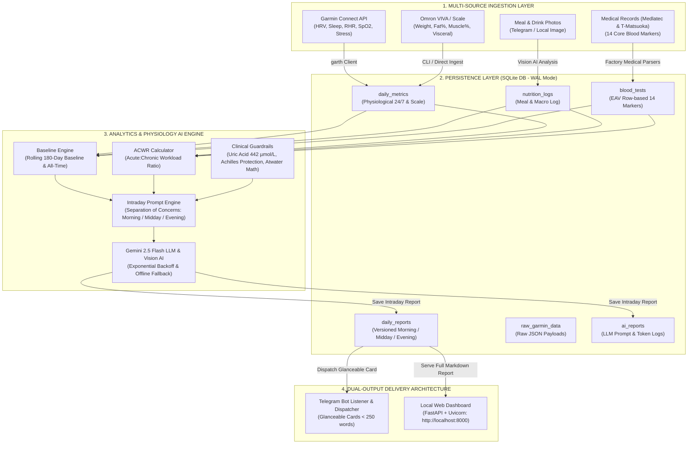
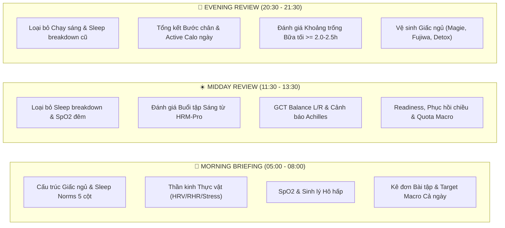
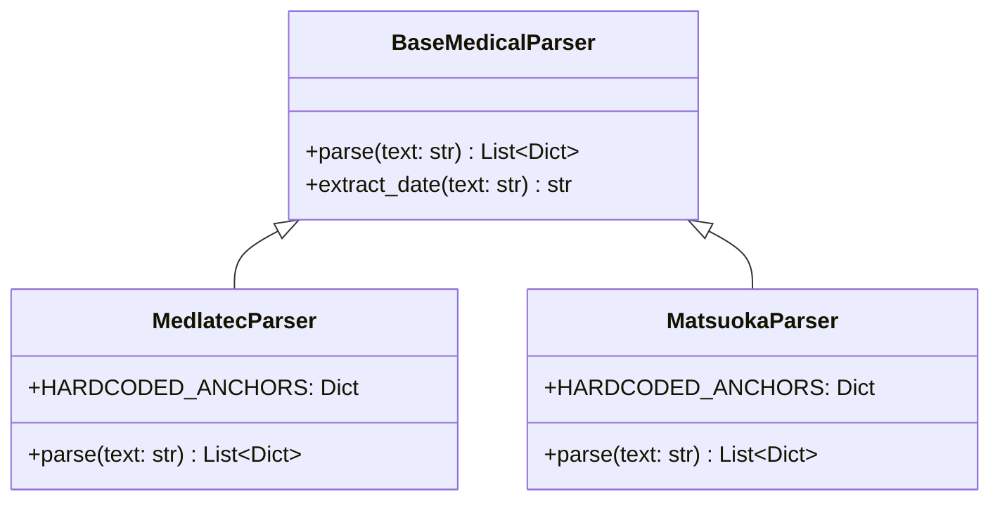

# 🏛️ Technical Architecture & System Specification
## `garmin-health-ai-pipeline`

---

## 1. Sơ Đồ Kiến Trúc & Luồng Dữ Liệu Tổng Thể (System Architecture & Data Flow)

**Garmin Health AI Pipeline** là hệ thống tự động hóa phân tích sinh lý học thể thao, đánh giá động học cơ sinh học chạy bộ và kê đơn dinh dưỡng cá nhân hóa thời gian thực (High-Performance Sports Physiology & Precision Nutrition) 2 chiều dành cho Vận động viên Đa môn (Multi-Sport Athlete & Marathoner).

```mermaid
flowchart TD
    subgraph S1["1. MULTI-SOURCE INGESTION LAYER"]
        A1["Garmin Connect API<br/>(HRV, Sleep, RHR, SpO2, Stress)"]
        A2["Omron VIVA / Scale<br/>(Weight, Fat%, Muscle%, Visceral)"]
        A3["Medical Records (Medlatec & T-Matsuoka)<br/>(14 Core Blood Markers)"]
        A4["Meal & Drink Photos<br/>(Telegram / Local Image)"]
    end

    subgraph S2["2. PERSISTENCE LAYER (SQLite DB - WAL Mode)"]
        B1["daily_metrics<br/>(Physiological 24/7 & Scale)"]
        B2["daily_reports<br/>(Versioned Morning / Midday / Evening)"]
        B3["nutrition_logs<br/>(Meal & Macro Log)"]
        B4["blood_tests<br/>(EAV Row-based 14 Markers)"]
        B5["raw_garmin_data<br/>(Raw JSON Payloads)"]
        B6["ai_reports<br/>(LLM Prompt & Token Logs)"]
    end

    subgraph S3["3. ANALYTICS & PHYSIOLOGY AI ENGINE"]
        C1["Baseline Engine<br/>(Rolling 180-Day Baseline & All-Time)"]
        C2["ACWR Calculator<br/>(Acute:Chronic Workload Ratio)"]
        C3["Clinical Guardrails<br/>(Uric Acid 442 µmol/L, Achilles Protection, Atwater Math)"]
        C4["Intraday Prompt Engine<br/>(Separation of Concerns: Morning / Midday / Evening)"]
        C5["Gemini 2.5 Flash LLM & Vision AI<br/>(Exponential Backoff & Offline Fallback)"]
    end

    subgraph S4["4. DUAL-OUTPUT DELIVERY ARCHITECTURE"]
        D1["Telegram Bot Listener & Dispatcher<br/>(Glanceable Cards < 250 words)"]
        D2["Local Web Dashboard<br/>(FastAPI + Uvicorn: http://localhost:8000)"]
    end

    A1 -->|garth Client| B1
    A2 -->|CLI / Direct Ingest| B1
    A3 -->|Factory Medical Parsers| B4
    A4 -->|Vision AI Analysis| B3

    B1 & B3 & B4 --> C1 & C2
    C1 & C2 & C3 --> C4 --> C5
    C5 -->|Save Intraday Report| B2 & B6

    B2 -->|Dispatch Glanceable Card| D1
    B2 -->|Serve Full Markdown Report| D2
```

---

## 2. Cấu Trúc Cơ Sở Dữ Liệu SQLite (`garmin_health.db`)

Dữ liệu được lưu trữ tập trung tại `data/garmin_health.db` với chế độ **WAL (Write-Ahead Logging)** và kích hoạt **Foreign Keys** (`PRAGMA foreign_keys = ON;`).

### Chi Tiết 6 Bảng Cốt Lõi:

1. **`daily_metrics`**:
   - Khóa chính: `date TEXT PRIMARY KEY` (YYYY-MM-DD).
   - Chứa toàn bộ thông số sinh lý học 24/7: `sleep_score`, `sleep_duration_seconds`, `deep_sleep_seconds`, `rem_sleep_seconds`, `light_sleep_seconds`, `awake_duration_seconds`, `hrv_last_night`, `resting_heart_rate`, `avg_stress_level`, `max_stress_level`, `spo2_avg`, `spo2_min`, `respiration_avg`, `respiration_min`, `respiration_max`, `training_load_7d`, `training_readiness_score`, `recovery_time_hours`, `training_status`, `weight_kg`, `body_fat_pct`, `muscle_mass_pct`, `visceral_fat`.

2. **`daily_reports`**:
   - Khóa chính hợp phần: `UNIQUE(date, report_type)`.
   - Lưu trữ các bản báo cáo sinh lý học phiên 3 ca: `date`, `report_type` (`'morning'`, `'midday'`, `'evening'`), `content` (Markdown đầy đủ), `metrics_snapshot` (JSON snapshot), `created_at`.

3. **`raw_garmin_data`**:
   - Khóa chính: `id INTEGER PRIMARY KEY AUTOINCREMENT`.
   - Ràng buộc: `UNIQUE(date, data_type)`.
   - Lưu trữ payload JSON gốc thu thập từ Garmin Connect API để tái kiểm tra khi cần.

4. **`nutrition_logs`**:
   - Khóa chính: `id INTEGER PRIMARY KEY AUTOINCREMENT`.
   - Lưu vết chi tiết từng bữa ăn: `date`, `timestamp`, `meal_type`, `dishes` (JSON array món ăn), `total_calories`, `protein_g`, `carb_g`, `fat_g`, `alcohol_units`, `sleep_risk_assessment`, `image_path`.

5. **`blood_tests`**:
   - Khóa chính: `id INTEGER PRIMARY KEY AUTOINCREMENT`.
   - Ràng buộc: `UNIQUE(test_date, marker_name)`.
   - Lưu trữ 14 chỉ số sinh hóa máu cốt lõi: `test_date`, `facility` ('Medlatec' / 'T-Matsuoka'), `category`, `marker_name`, `value`, `value_text`, `unit`, `ref_min`, `ref_max`, `status` ('NORMAL', 'HIGH', 'LOW').

6. **`ai_reports`**:
   - Khóa chính: `id INTEGER PRIMARY KEY AUTOINCREMENT`.
   - Nhật ký lịch sử các phiên gọi LLM API: `date`, `report_markdown`, `raw_prompt`, `model_used`, `status`, `prompt_tokens`, `completion_tokens`, `delivered_status`, `created_at`.

---

## 3. Nguyên Tắc Phân Tách 3 Phiên Báo Cáo (Separation of Concerns)

Để triệt tiêu tình trạng trùng lặp thông tin và tối ưu dung lượng hiển thị trên Web Dashboard, mỗi phiên báo cáo được thiết kế chuyên biệt theo đúng nhiệm vụ sinh lý học của mốc thời gian:

```mermaid
flowchart LR
    subgraph Morning["🌅 MORNING BRIEFING (05:00 - 08:00)"]
        M1["Cấu trúc Giấc ngủ & Sleep Norms 5 cột"]
        M2["Thần kinh Thực vật (HRV/RHR/Stress)"]
        M3["SpO2 & Sinh lý Hô hấp"]
        M4["Kê đơn Bài tập & Target Macro Cả ngày"]
    end

    subgraph Midday["☀️ MIDDAY REVIEW (11:30 - 13:30)"]
        N1["Loại bỏ Sleep breakdown & SpO2 đêm"]
        N2["Đánh giá Buổi tập Sáng từ HRM-Pro"]
        N3["GCT Balance L/R & Cảnh báo Achilles"]
        N4["Readiness, Phục hồi chiều & Quota Macro"]
    end

    subgraph Evening["🌙 EVENING REVIEW (20:30 - 21:30)"]
        E1["Loại bỏ Chạy sáng & Sleep breakdown cũ"]
        E2["Tổng kết Bước chân & Active Calo ngày"]
        E3["Đánh giá Khoảng trống Bữa tối >= 2.0-2.5h"]
        E4["Vệ sinh Giấc ngủ (Magie, Fujiwa, Detox)"]
    end
```

---

## 4. Ràng Buộc Y Học Thể Thao & Lâm Sàng Cốt Lõi (Clinical Guardrails)

1. **Khóa An Toàn Acid Uric (442 µmol/L):**
   - Vận động viên có Uric Acid tiệm cận ngưỡng bão hòa dịch khớp EULAR (442 µmol/L > 420 µmol/L).
   - **Quy tắc:** Bữa tối của ngày Rest/Taper tuyệt đối **KHÔNG ĐƯỢC VƯỢT QUÁ 30.0g Protein** để tránh gây quá tải lọc thận ban đêm và suy giảm HRV. Lượng đạm thừa phải phân bổ sang bữa phụ chiều.

2. **Cảnh Báo Động Học Cơ Sinh Học & Bảo Vệ Gân Achilles Trái:**
   - Khi Cân bằng tiếp đất `GCT Balance Left >= 51.0% L`, hệ thống tự động kích hoạt **Cờ bảo vệ gân Achilles trái**.
   - **Quy tắc:** Ép guồng chân `Cadence locked 178 - 182 spm` để đưa GCT Balance về 50.3% L, kê đơn 3 tổ bài tập hạ gót thụ động (`Eccentric Heel Drops`) trên bậc thềm và loại bỏ tuyệt đối bài bứt tốc Strides 85-90%.

3. **Kiểm Định Chuẩn Toán Học Atwater (Macro Integrity Check):**
   - Mọi món ăn đề xuất trong thực đơn phải thỏa mãn công thức Atwater với sai số cho phép:
     $$\text{abs}\left(\text{Calories} - (\text{Protein} \times 4 + \text{Carbs} \times 4 + \text{Fat} \times 9)\right) \le 4.0\text{ kcal}$$
   - Không khống carb của cam tươi (100g cam tươi chứa ~9.5g C, ~47 kcal, tuyệt đối không tính 44.2g C vào 40 kcal).

4. **Chỉ Số Tải Tập Luyện ACWR (Acute:Chronic Workload Ratio):**
   - `ACWR < 0.3`: Cảnh báo nguy cơ "ì cơ" (`stale legs`). Yêu cầu duy trì neuromuscular tension bằng bài chạy nhẹ Zone 2 + cadence cao 178-182 spm.
   - `ACWR 1.5 - 1.6`: Cảnh báo vùng nguy cơ chấn thương cao, bắt buộc giảm tải.

---

## 5. Thiết Kế Factory Pattern Cho Medical Parsers

```mermaid
classDiagram
    class BaseMedicalParser {
        +parse(text: str) List~Dict~
        +extract_date(text: str) str
    }
    class MedlatecParser {
        +HARDCODED_ANCHORS: Dict
        +parse(text: str) List~Dict~
    }
    class MatsuokaParser {
        +HARDCODED_ANCHORS: Dict
        +parse(text: str) List~Dict~
    }
    BaseMedicalParser <|-- MedlatecParser
    BaseMedicalParser <|-- MatsuokaParser
```

---

## 6. Kiến Trúc Dual-Output Delivery

1. **Telegram Glanceable Card (Thẻ Tóm Tắt Tác Chiến):**
   - Bản tóm tắt nhanh dưới 200 - 250 từ, đọc xong trong 15 giây.
   - Định dạng gạch đầu dòng trực diện theo khung giờ. Chân thẻ đính kèm link bài đọc chi tiết:
     `📄 Xem phân tích chi tiết: http://localhost:8000/report/{date}/{report_type}`

2. **Local Web Dashboard (FastAPI + Uvicorn):**
   - Đọc trực tiếp nội dung Markdown đầy đủ từ bảng `daily_reports` trong SQLite (`data/garmin_health.db`).
   - Endpoint `GET /`: Trang chủ hiển thị danh sách các ngày có báo cáo kèm badge chỉ số (`morning`, `midday`, `evening`).
   - Endpoint `GET /report/{date}/{report_type}`: Render báo cáo Markdown thành giao diện HTML chuẩn y học thể thao, bảo mật 100% dữ liệu sức khỏe trên PC cá nhân.
