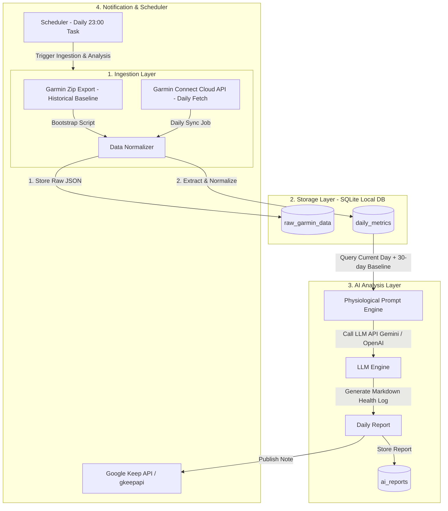

# GARMIN HEALTH AI PIPELINE - PROJECT SPECIFICATION

**Tên dự án:** Garmin Health AI Pipeline  
**Loại ứng dụng:** Personal Backend Automation System (Chạy Local trên PC)  
**Mục tiêu:** Tự động hóa thu thập dữ liệu sinh lý từ Garmin Connect, lưu trữ cơ sở dữ liệu định lượng dài hạn trên PC local, sử dụng LLM để phân tích tương quan sinh lý học (30 ngày baseline vs ngày hiện tại) và gửi báo cáo nhật ký sức khỏe hàng ngày qua Google Keep lúc 23:00.

---

## 1. NGUYÊN TẮC CỐT LÕI & THIẾT KẾ RÀNG BUỘC

1. **Trung thực dữ liệu (Strict Factual Data):**
   - Không được tự suy diễn hoặc điền trung bình/ước tính cho các chỉ số Garmin không ghi nhận.
   - Nếu thiếu chỉ số (do tháo đồng hồ, không đo được HRV, không ghi nhận Sleep, v.v.), giá trị lưu trữ và xử lý trong database/model phải là `NULL` (`None` trong Python).
2. **Thiết kế kiến trúc dạng Modular (Decoupled Architecture):**
   - Chia tách độc lập 5 thành phần: Ingestion, Storage, Analysis, Notification, Scheduler.
   - Mỗi module tương tác qua Interface/Data Class chuẩn xác (`pydantic`).
3. **Bảo mật & Quyền riêng tư (Security & Privacy First):**
   - Toàn bộ thông tin tài khoản Garmin (Username/Password), LLM API Keys, Token session, Google Keep credentials phải lưu trong file `.env`.
   - File `.env`, `.garminconnect` (session tokens cache), database file (`garmin_health.db`) PHẢI được thêm vào `.gitignore`.

---

## 2. KIẾN TRÚC LUỒNG LUÂN CHUYỂN DỮ LIỆU (DATA PIPELINE ARCHITECTURE)



### Chi tiết luồng dữ liệu (Data Flow):
1. **Trigger (23:00):** Scheduler kích hoạt pipeline daily run.
2. **Ingestion:** API Ingestion kết nối Garmin Connect Cloud, lấy các chỉ số của ngày hiện tại (Sleep, HRV, Heart Rate, Stress, Body Battery, Activities).
3. **Raw Storage:** Lưu nguyên bản Raw JSON từ Garmin vào bảng `raw_garmin_data` để bảo toàn dữ liệu gốc.
4. **Normalization:** Parse và validate các trường dữ liệu quan trọng đưa vào bảng `daily_metrics`.
5. **Baseline Retrieval:** Lấy chỉ số ngày hiện tại + tính thống kê (trung bình, xu hướng) của 30 ngày gần nhất từ `daily_metrics`.
6. **LLM Prompting:** Xây dựng Prompt phân tích sinh lý học đa chiều gửi đến LLM (Gemini 1.5/2.0 hoặc GPT-4o-mini).
7. **Report Storage & Dispatch:** Lưu kết quả phân tích vào bảng `ai_reports` và đẩy bản tin hoàn chỉnh dạng Markdown lên Google Keep.

---

## 3. CƠ SỞ DỮ LIỆU & SCHEMA CHUYỂN ĐỔI (DATA SCHEMA)

Sử dụng **SQLite** lưu trữ file local `data/garmin_health.db`.

### 3.1. Bảng `raw_garmin_data` (Lưu JSON gốc)
| Tên trường | Kiểu dữ liệu | Mô tả |
| :--- | :--- | :--- |
| `id` | INTEGER PRIMARY KEY AUTOINCREMENT | Key tự tăng |
| `date` | TEXT NOT NULL | Ngày dữ liệu (`YYYY-MM-DD`) |
| `data_type` | TEXT NOT NULL | Loại dữ liệu (`SLEEP`, `HRV`, `STRESS`, `BODY_BATTERY`, `ACTIVITIES`) |
| `raw_json` | TEXT NOT NULL | Chuỗi JSON thô từ Garmin |
| `created_at` | DATETIME DEFAULT CURRENT_TIMESTAMP | Thời gian lưu |

### 3.2. Bảng `daily_metrics` (Bảng chỉ số chuẩn hóa hàng ngày)
| Tên trường | Kiểu dữ liệu | Ràng buộc | Mô tả |
| :--- | :--- | :--- | :--- |
| `date` | TEXT | PRIMARY KEY | Ngày ghi nhận (`YYYY-MM-DD`) |
| `sleep_score` | INTEGER | NULLABLE | Điểm số giấc ngủ (0 - 100) |
| `sleep_duration_seconds` | INTEGER | NULLABLE | Tổng thời lượng ngủ (giây) |
| `deep_sleep_seconds` | INTEGER | NULLABLE | Thời gian ngủ sâu (giây) |
| `rem_sleep_seconds` | INTEGER | NULLABLE | Thời gian ngủ REM (giây) |
| `light_sleep_seconds` | INTEGER | NULLABLE | Thời gian ngủ nông (giây) |
| `hrv_weekly_avg` | REAL | NULLABLE | Trung bình HRV 7 ngày (ms) |
| `hrv_last_night` | REAL | NULLABLE | Chỉ số HRV ban đêm vừa qua (ms) |
| `hrv_status` | TEXT | NULLABLE | Trạng thái HRV (`BALANCED`, `UNBALANCED`, `LOW`, `POOR`) |
| `resting_heart_rate` | INTEGER | NULLABLE | Nhịp tim lúc nghỉ RHR (bpm) |
| `avg_stress_level` | INTEGER | NULLABLE | Mức độ stress trung bình (1 - 100) |
| `max_stress_level` | INTEGER | NULLABLE | Mức độ stress cao nhất |
| `body_battery_charged` | INTEGER | NULLABLE | Lượng Body Battery nạp được |
| `body_battery_drained` | INTEGER | NULLABLE | Lượng Body Battery đã tiêu thụ |
| `body_battery_highest` | INTEGER | NULLABLE | Mức Body Battery cao nhất trong ngày |
| `body_battery_lowest` | INTEGER | NULLABLE | Mức Body Battery thấp nhất trong ngày |
| `active_calories` | INTEGER | NULLABLE | Calo vận động (kcal) |
| `total_steps` | INTEGER | NULLABLE | Tổng số bước chân |
| `vo2_max` | REAL | NULLABLE | Chỉ số VO2 Max |
| `activities_summary` | TEXT | NULLABLE | JSON tóm tắt các bài tập thể thao trong ngày |
| `raw_sync_timestamp` | DATETIME | NULLABLE | Thời điểm đồng bộ từ Garmin |
| `updated_at` | DATETIME | DEFAULT CURRENT_TIMESTAMP | Thời điểm cập nhật bản ghi |

### 3.3. Bảng `ai_reports` (Lưu lịch sử báo cáo AI)
| Tên trường | Kiểu dữ liệu | Mô tả |
| :--- | :--- | :--- |
| `date` | TEXT PRIMARY KEY | Ngày báo cáo (`YYYY-MM-DD`) |
| `prompt_tokens` | INTEGER | Số token đầu vào |
| `completion_tokens` | INTEGER | Số token đầu ra |
| `report_markdown` | TEXT NOT NULL | Nội dung báo cáo Markdown hoàn chỉnh |
| `delivered_status` | TEXT DEFAULT 'PENDING' | Trạng thái gửi (`SUCCESS`, `FAILED`, `PENDING`) |
| `created_at` | DATETIME DEFAULT CURRENT_TIMESTAMP | Thời gian tạo |

---

## 4. CÔNG NGHỆ & THƯ VIỆN PYTHON NÒNG CỐT

| Thành phần | Thư viện / Công nghệ | Lý do chọn |
| :--- | :--- | :--- |
| **Language** | Python 3.11+ | Hệ sinh thái AI & Data mạnh mẽ |
| **Garmin API** | `garminconnect` | Thư viện Python giao tiếp Garmin Connect API chính chủ/community ổn định nhất |
| **Database & Schema** | `sqlite3` + `pydantic` | SQLite nhẹ, zero-config local DB. Pydantic validate type & strict NULL checking |
| **ZIP Bootstrap** | `zipfile` + `json` + `csv` | Module tiêu chuẩn xử lý gói file Garmin Export |
| **LLM Client** | `google-genai` / `openai` | SDK chính thức gọi Gemini API / OpenAI API |
| **Google Keep** | `gkeepapi` | Thư viện Python tương tác với Google Keep (sử dụng Master Token / OAuth App Password) |
| **Scheduler** | `apscheduler` / `schedule` | Quản lý tác vụ định kỳ 23:00 linh hoạt trên Windows PC |
| **Configuration** | `python-dotenv` | Load biến môi trường từ `.env` an toàn |
| **CLI & Tools** | `click` hoặc `typer` | Xây dựng CLI chạy lệnh bootstrap, manual sync, backfill |

---

## 5. CẤU TRÚC THƯ MỤC DỰ ÁN DỰ KIẾN (PROJECT STRUCTURE)

```
garmin-health-ai-pipeline/
├── PROJECT_SPEC.md              # File spec tổng quan kiến trúc (file này)
├── .env.example                 # File mẫu khai báo biến môi trường
├── .gitignore                   # Khai báo loại trừ file nhạy cảm & DB
├── pyproject.toml / requirements.txt # Khai báo dependencies
├── main.py                      # CLI entrypoint (sync, bootstrap, schedule)
├── data/                        # Thư mục lưu DB local (git-ignored)
│   └── garmin_health.db
├── src/
│   ├── __init__.py
│   ├── config.py                # Pydantic Settings & Env loader
│   ├── ingestion/
│   │   ├── __init__.py
│   │   ├── garmin_client.py     # Garmin Connect API Client
│   │   └── zip_parser.py        # Process Garmin Historical ZIP export
│   ├── storage/
│   │   ├── __init__.py
│   │   ├── db.py                # Database connection & init schema
│   │   ├── models.py            # Pydantic Data Models
│   │   └── repository.py        # CRUD operations cho daily_metrics & raw_json
│   ├── analysis/
│   │   ├── __init__.py
│   │   ├── baseline.py          # Tính toán chỉ số 30 ngày baseline
│   │   ├── prompt_templates.py  # Prompt Sinh lý học (Sleep ↔ HRV ↔ Stress...)
│   │   └── llm_analyzer.py      # LLM API caller (Gemini/OpenAI)
│   ├── notification/
│   │   ├── __init__.py
│   │   └── keep_notifier.py     # Gửi báo cáo lên Google Keep
│   └── scheduler/
│       ├── __init__.py
│       └── runner.py            # Scheduler kích hoạt daily job lúc 23:00
└── tests/
    └── test_pipeline.py
```

---

## 6. KẾ HOẠCH TRIỂN KHAI THEO TỪNG PHASE (ROADMAP)

### Phase 1: Môi trường & Bootstrap Dữ liệu Lịch sử (Baseline Setup)
- Khởi tạo repo Python, setup `.env.example`, `.gitignore`, và cấu trúc thư mục.
- Khởi tạo SQLite Database Schema (`raw_garmin_data`, `daily_metrics`, `ai_reports`).
- Viết `src/ingestion/zip_parser.py`: Đọc gói ZIP Garmin Export lịch sử, trích xuất metrics quá khứ và nạp baseline vào DB.

### Phase 2: Live Ingestion & Garmin API Sync
- Xây dựng `src/ingestion/garmin_client.py`: Tự động đăng nhập Garmin Connect bằng Token Cache.
- Triển khai chức năng kéo dữ liệu ngày hiện tại (`get_sleep_data`, `get_hrv_data`, `get_user_summary`, `get_activities`).
- Xử lý lưu Raw JSON và Normalization chính xác (Strict NULL handling).

### Phase 3: AI Correlation Analysis Engine
- Viết module `src/analysis/baseline.py`: Trích xuất chỉ số ngày chạy + tính toán trung bình/độ lệch 30 ngày gần nhất.
- Thiết kế Prompt sinh lý chuyên sâu (Tương quan giữa Giấc ngủ ↔ HRV ↔ RHR ↔ Stress ↔ Body Battery ↔ Bài tập).
- Tích hợp LLM API Client (`google-genai` / `openai`) để sinh báo cáo Markdown giàu thông tin.

### Phase 4: Integration với Google Keep & Scheduler
- Triển khai `src/notification/keep_notifier.py`: Tạo/cập nhật Note hàng ngày trên Google Keep với định dạng Markdown sạch sẽ.
- Triển khai `src/scheduler/runner.py`: Tự động kích hoạt toàn bộ Pipeline vào 23:00 mỗi đêm.
- Hướng dẫn cài đặt Windows Task Scheduler / Background Service chạy ngầm trên PC.

### Phase 5: Verification, CLI & Polishing
- Hoàn thiện CLI Tool (`main.py`) hỗ trợ các lệnh: `main.py bootstrap <path_to_zip>`, `main.py sync-today`, `main.py run-schedule`.
- Kiểm thử tích hợp toàn bộ pipeline từ Ingestion -> Storage -> Analysis -> Notification.
