# 🏃‍♂️ Garmin Health AI Pipeline

Một hệ thống tự động hóa phân tích sinh lý học thể thao, đánh giá cơ sinh học chạy bộ và kê đơn dinh dưỡng cá nhân hóa thời gian thực (High-Performance Sports Physiology & Precision Nutrition) 2 chiều dành cho Vận động viên Đa môn (Multi-Sport Athlete).

---

## 📋 Yêu Cầu Môi Trường (Prerequisites)

- **Python**: `Python 3.11+`
- **Các Thư Viện Cốt Lõi**:
  - `google-genai` (Google Gemini AI API SDK)
  - `fitparse` (Decode Garmin FIT binary running files)
  - `tqdm` (Thanh tiến trình đồng bộ dữ liệu)
  - `requests`, `pillow`, `click`, `pydantic`

---

## ⚙️ Hướng Dẫn Cài Đặt & Thiết Lập Cấu Hình

### 1. Clone Repository & Cài Đặt Dependencies
```bash
git clone <URL_REPO>
cd garmin-health-ai-pipeline
python -m venv venv
venv\Scripts\activate  # Trên Windows
pip install -r requirements.txt
```

### 2. Thiết Lập Biến Môi Trường (`.env`)
Sao chép file mẫu `.env.example` thành `.env` và cập nhật các API Token của bạn:
```bash
cp .env.example .env
```
Nội dung mẫu file `.env`:
```env
TELEGRAM_BOT_TOKEN="your_telegram_bot_token_here"
TELEGRAM_CHAT_ID="your_telegram_chat_id_here"
GEMINI_API_KEY="your_gemini_api_key_here"
GARMIN_EMAIL="your_garmin_email_here"
GARMIN_PASSWORD="your_garmin_password_here"
DB_PATH="data/garmin_health.db"
```

---

## 🖥️ Danh Mục Lệnh Vận Hành CLI (`main.py`)

Hệ thống cung cấp giao diện dòng lệnh (CLI) điều khiển toàn bộ các tác vụ xử lý dữ liệu và AI:

| Lệnh CLI | Mục Đích Sử Dụng | Cú Pháp Thực Tế |
| :--- | :--- | :--- |
| `process-garmin-zip` | **[Giải nén In-Memory]** Quét và đọc dữ liệu trực tiếp từ file ZIP xuất bản của Garmin (Sleep JSON & FIT running files). | `python main.py process-garmin-zip --zip-path data/garmin_export.zip` |
| `analyze-achilles` | **[Phân tích Cơ sinh học]** Xuất báo cáo tương quan Cadence vs GCT Balance L/R và nguy cơ quá tải gân Achilles. | `python main.py analyze-achilles` |
| `run-bot` (hoặc `bot`) | **[Telegram Bot Daemon]** Khởi chạy Telegram Bot listener 24/7 (lắng nghe ảnh bữa ăn, lệnh `/report`, `/sync`, `/status`). | `python main.py bot` |
| `run-daily` (hoặc `daily-report`) | **[Quy trình Hàng ngày]** Chạy tự động chuỗi 4 bước: Đồng bộ live -> Tính baseline -> Sinh báo cáo Gemini -> Bắn 4 thẻ Telegram. | `python main.py run-daily` |
| `log-weight` | Ghi nhận cân nặng OMRON VIVA và đồng bộ lên Garmin Connect cloud. | `python main.py log-weight 65.4 --fat 17.5 --muscle 37.2 --visceral 6` |
| `sync-today` | Synchronize live Garmin metrics today into SQLite without generating AI report. | `python main.py sync-today` |
| `sync-range` | Kéo bù N ngày liên tiếp gần nhất để tái tạo dải Baseline. | `python main.py sync-range --days 30` |
| `analyze` | Phân tích sinh lý học AI cho 1 ngày cụ thể và xuất file journal Markdown. | `python main.py analyze --date 2026-09-26` |
| `import-apple-health` | Import dữ liệu cân nặng từ file export Apple Health. | `python main.py import-apple-health data/export.zip` |
| `status` | Kiểm tra số lượng bản ghi và tình trạng cơ sở dữ liệu SQLite. | `python main.py status` |
| `init` | Khởi tạo cấu trúc cơ sở dữ liệu SQLite ban đầu. | `python main.py init` |

---

## 🏗️ Kiến Trúc Luồng Dữ Liệu (Mermaid Diagram)

```mermaid
flowchart TD
    subgraph Inputs["1. Dữ liệu Đầu vào (Multi-Source Ingestion)"]
        A[Garmin Epix Watch & HRM-Pro API] -->|HRV, RHR, Sleep, SpO2, Cadence, GCT| C[(SQLite DB: data/garmin_health.db)]
        B[OMRON VIVA Scale / Google Fit] -->|Weight 65.4kg, Body Fat %, Muscle %| C
        D[In-memory ZIP Extractor Engine] -->|2,582 Ngày & 602 Bài chạy FIT| C
        E[Telegram Bot Photo & Quick Log] -->|Ảnh đồ ăn/nhậu + Caption| F[Gemini Multimodal Vision API]
        F -->|Bóc tách Macros P/C/F, Calo, Cồn| C
    end

    subgraph Core["2. Engine Phân tích & Dynamic AI"]
        C --> G[Dual-Baseline 180d & Baseline All-Time]
        G --> H[Achilles Risk & Cadence Sweet Spot Optimizer]
        H --> I[Gemini 1.5 LLM Analyst & Dynamic Macro Math]
    end

    subgraph Output["3. Phát Tin Nhắn Telegram Cards"]
        I -->|Section Break| J[Telegram Message Dispatcher]
        J -->|Thẻ 1| K1[🧠 1. Thần kinh Thực vật & Hô hấp]
        J -->|Thẻ 2| K2[💤 2. Bóc tách Giấc ngủ & Đồ nhậu]
        J -->|Thẻ 3| K3[🏃‍♂️ 3. Kê đơn Vận động & Cadence]
        J -->|Thẻ 4| K4[🍱 4. Kê đơn Dinh dưỡng & Macro Bù trừ]
    end
```



---

## 🧪 Kiểm Thử Hệ Thống (Testing)

Chạy bộ kiểm thử tự động với Pytest:
```bash
python -m pytest
```

---

## 📄 Giấy Phép & Đóng Góp
Dự án được xây dựng phục vụ vận động viên đa môn và cộng đồng chạy bộ marathon.
Mọi chi tiết kiến trúc chuyên sâu vui lòng tham khảo [docs/ARCHITECTURE.md](docs/ARCHITECTURE.md).
