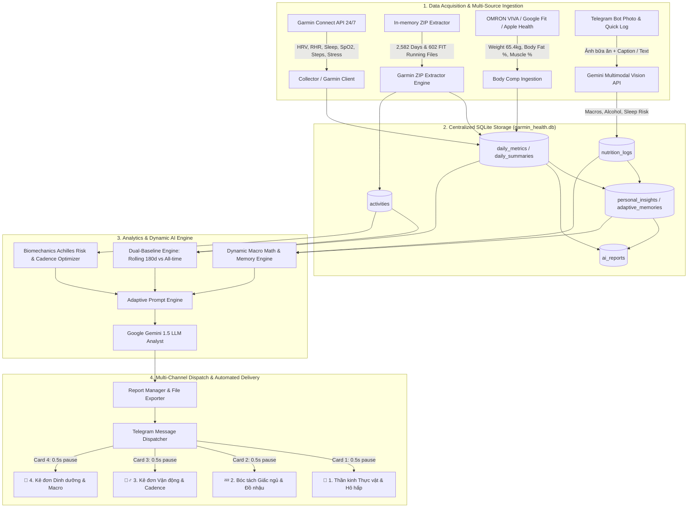

# 🏛️ Garmin Health AI Pipeline — Technical Architecture Document

## 1. Tổng Quan Mục Tiêu & Triết Lý Hệ Thống

**Garmin Health AI Pipeline** là một hệ sinh thái mã nguồn mở phục vụ giám sát sinh lý học thể thao, phân tích cơ sinh học chạy bộ và kê đơn dinh dưỡng cá nhân hóa thời gian thực dành cho Vận động viên Đa môn (Multi-Sport Athlete), đặc biệt tối ưu cho các chu kỳ huấn luyện và Tapering thi đấu Full Marathon (FM 42.195 km).

### Triết lý Cốt lõi (Core Principles):
1. **Phân tích Sinh lý học & Phục hồi Toàn diện:**
   - Theo dõi Cân bằng Thần kinh Thực vật (HRV Overnight), Nhịp tim nghỉ (RHR Deviation), Nồng độ Oxy SpO2 ban đêm, và Cấu trúc Giấc ngủ (Deep, REM, Light, Awake) đối chiếu với dải **Baseline 180 ngày** và **Baseline Toàn lịch sử**.
   - Nhận diện trạng thái "Siêu phục hồi" (Supercompensation) hoặc Cảnh báo Nguy cơ Hạ đường huyết ban đêm (Nocturnal Hypoglycemia).

2. **Phân tích Cơ sinh học Động học HRM-Pro (Biomechanics Analysis):**
   - Bóc tách dữ liệu từ **602 bài chạy FIT** & 2,582 ngày theo dõi để phát hiện mối tương quan giữa Cân bằng Tiếp đất (GCT Balance L/R) và Nhịp bước (Cadence).
   - Thiết lập **Cadence Sweet Spot (178 - 182 spm)** để kéo lệch tiếp đất từ `51.7% L` về mốc an toàn `50.3% L`, giải phóng `4.5 kg - 6.0 kg` lực xung kích va đập cơ học trên mỗi bước chạy, bảo vệ gân Achilles chân trái.

3. **Toán học Dinh dưỡng Bù trừ Thời gian thực (Precision Nutrition Math):**
   - Động hóa công thức tính BMR theo cân nặng thực tế từ cân OMRON VIVA:
     $$BMR \approx 10 \cdot weight\_kg + 6.25 \cdot height\_cm - 5 \cdot age + 5$$
   - Phân bổ dải Macro chuẩn: Protein (`1.8 - 2.0g/kg`), Fat (`0.8 - 1.0g/kg`), Carb phức hợp bù phần calo còn thiếu.
   - Phân phép tính bù trừ chính xác từng Calo và gram Protein: $(Target) - (Logged) = (Remaining)$, kê đơn các bữa tiếp theo khớp 100% không làm tròn sai lệch.

4. **Bối cảnh Thi đấu & Tapering (Stage-Based Weight & Carbo-Loading):**
   - Trong tuần Tapering ($\le 10$ ngày đến Race): TUYỆT ĐỐI KHÔNG SIẾT CÂN HAY CẮT CALO. Cân nặng 65.0 - 66.5 kg là thể trạng tối ưu.
   - Trong pha Carbo-Loading ($\le 3$ ngày đến Race): Giải thích hiện tượng sinh lý tích tụ Glycogen ngậm nước (+3g nước/1g glycogen gây tăng nhẹ +0.5 kg đến +1.2 kg) là dấu hiệu năng lượng dồi dào, không phải mỡ thừa.

---

## 2. Sơ Đồ Luồng Dữ Liệu Tổng Thể (Data Flow Architecture)

---

## 3. Chi Tiết Kiến Trúc Từng Module (`src/`)

### 3.1. Package `src/ingestion/` (Data Ingestion & Collectors)
Trách nhiệm: Thu thập, trích xuất và lưu trữ dữ liệu thô từ nhiều nguồn khác nhau.
- `garmin_client.py`: Client kết nối Garmin Connect API qua thư viện `garth` / OAuth session tokens. Quản lý việc kéo dữ liệu giấc ngủ, nhịp tim, HRV, bài tập và cập nhật cân nặng lên Garmin Cloud.
- `collector.py`: Module điều phối chính cho việc đồng bộ dữ liệu hàng ngày (`fetch_and_store_daily_data`) và kéo bù lịch sử (`backfill_historical_data`).
- `browser_session_client.py`: Session adapter hỗ trợ fallback qua Browser Cookies / cURL khi API Mobile bị giới hạn rate limit 429.
- `garmin_zip_extractor.py`: Trích xuất và giải nén dữ liệu in-memory từ archive ZIP xuất bản toàn lịch sử của Garmin. Đọc cấu trúc file JSON và phân tích file `.fit` chạy bộ.
- `google_health_client.py`: Đồng bộ dữ liệu chỉ số thành phần cơ thể từ Google Fit REST API.

### 3.2. Package `src/analytics/` (Physiology Analytics & AI Engines)
Trách nhiệm: Tính toán baseline, phân tích sinh lý học, xây dựng prompt và gọi Gemini AI API.
- `baseline.py`: Trích xuất dữ liệu baseline 30 ngày và **180 ngày gần nhất** (`get_180d_sleep_baseline`) từ SQLite để tính giá trị trung bình chuẩn cho SpO2, RHR, HRV và các pha giấc ngủ.
- `prompt_engine.py`: Trái tim của hệ thống. Chứa `SYSTEM_PROMPT` và hàm `build_advanced_user_prompt`. Xây dựng các khối dữ liệu chuyên sâu:
  - Hồ sơ biometric VĐV & quy tắc cân nặng theo giai đoạn Tapering / Thường.
  - Phân tích nhân quả Nocturnal Hypoglycemia & Stress đêm.
  - Nhúng bảng đối chuẩn Cấu trúc Giấc ngủ (Sleep Norms Benchmark).
  - Động hóa BMR, Target Calories, Target Macros và phép trừ lùi bù trừ dinh dưỡng.
  - Kê đơn vận động đa môn (Neuromuscular Priming vs Swimming).
- `llm_analyst.py`: Giao tiếp với Google Gemini API (`google-genai` SDK) với cơ chế tự động fallback các model (`gemini-3.6-flash`, `gemini-3.5-flash-lite`, `gemini-3.1-pro-preview`).
- `vision_analyst.py`: Phân tích ảnh bữa ăn / đồ nhậu / thức uống bằng Gemini Multimodal Vision API. Nhận diện dược lý thực phẩm (enzyme Bromelain từ dứa, Nitrate từ cần tây) và xuất đủ 3 chỉ số Macro (Protein, Carb, Fat).
- `memory_engine.py`: Động cơ học hỏi liên tục (Continuous Learning), tự động rút ra các bài học sinh lý học dài hạn và lưu trữ trong bảng `personal_insights`.
- `analyze_achilles_risk.py`: Phân tích độ tương quan giữa Cadence và GCT Balance L/R trên 602 bài chạy FIT.
- `evening_checkin.py`: Sinh thẻ báo cáo kiểm tra thể trạng & bù nước trước giờ ngủ 21:00.

### 3.3. Package `src/db/` (Database & Persistence Layer)
Trách nhiệm: Quản lý SQLite database schema, kết nối và repository.
- `connection.py`: Khởi tạo và quản lý SQLite connection context manager (`garmin_health.db`).
- `schema.py`: Đĩnh nghĩa cấu trúc bảng SQLite: `daily_metrics`, `activities`, `nutrition_logs`, `personal_insights`, `ai_reports`, `raw_garmin_data`.
- `models.py`: Dataclass định nghĩa cấu trúc đối tượng dữ liệu sinh lý (`DailyMetrics`).
- `nutrition_repository.py`: Quản lý lưu trữ, truy vấn và khử trùng lặp thông minh (deduplication) các bản ghi bữa ăn.

### 3.4. Package `src/delivery/` (Message Dispatching & User Interface)
Trách nhiệm: Gửi báo cáo và tương tác với người dùng qua Telegram Bot.
- `telegram_bot.py`: Class `TelegramMealBot` với cơ chế Singleton PID Lock (`.bot.lock`), long-polling listener chống rớt mạng (ConnectionResetError resilience), phân tách 4 thẻ tin nhắn HTML / Markdown với thời gian nghỉ 0.5s giữa các thẻ.
- `telegraph_publisher.py`: Đăng tải báo cáo dài lên trang web Telegraph và tạo đường dẫn đọc nhanh.

### 3.5. Package `src/importers/` (File & Export Importers)
- `zip_importer.py`: Importer đọc file export ZIP Garmin.
- `apple_health_importer.py`: Importer giải nén và trích xuất chỉ số cân nặng / phần trăm mỡ từ file `export.zip` hoặc `export.xml` của Apple Health.

---

## 4. Kiểm Soát Bảo Mật & Luồng Đẩy Mã Nguồn (Git Security & Workflow)

Toàn bộ thông tin nhạy cảm (API Keys, Tokens, Mật khẩu Garmin, Cookie session, Cơ sở dữ liệu cá nhân SQLite, Ảnh chụp bữa ăn) được cô lập nghiêm ngặt qua file `.gitignore` và không bao giờ được đưa lên hệ thống quản lý phiên bản Git.
